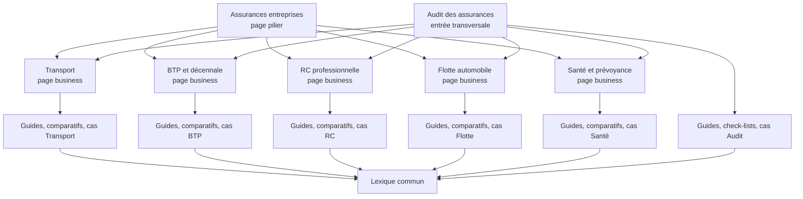

# Mission 40 — Construction du cluster SEO business

Date de cadrage : 31 juillet 2026

Périmètre : stratégie éditoriale et maillage, sans création de contenu ni modification du site

Domaine canonique : `https://www.assuromieuxparis.com/`

## Décision directrice

Le meilleur potentiel ne vient pas d’un grand nombre de pages. Il vient de six cocons resserrés, centrés sur une page business, avec des satellites qui répondent chacun à une intention distincte : comprendre, vérifier, comparer, préparer une décision ou examiner un cas réel.

L’ordre d’investissement recommandé est celui demandé :

1. Transport ;
2. Décennale ;
3. RC professionnelle ;
4. Flotte automobile ;
5. Santé et prévoyance collective ;
6. Audit des assurances.

Trois règles protègent la qualité du dispositif :

- publier ou consolider l’existant avant de créer une route ;
- ne jamais créer une URL par question de FAQ, par métier ou par variante de mot-clé ;
- n’ouvrir une nouvelle route que si son intention, sa cible, son CTA et sa frontière avec la page business sont documentés.

## État de départ vérifié

Le système central compte actuellement 19 routes indexables. Les six pages business visées sont déjà indexables. Trois guides sont publiés et indexables ; deux guides directement utiles aux clusters prioritaires restent en relecture.

| Cluster | Page business centrale | Actifs existants | Statut | Première décision |
|---|---|---|---|---|
| Transport | `/assurance-transport/` | 3 pages secteurs ; 1 guide Transport ; hub `/ressources/transport-logistique/` | page business et secteurs indexables ; guide `review-required` ; hub noindex | valider le guide avant toute nouvelle publication |
| Décennale | `/assurance-btp-decennale/` | 1 guide Décennale ; hub `/ressources/btp/` | page business indexable ; guide `review-required` ; hub noindex | valider le guide puis créer un seul satellite complémentaire |
| RC professionnelle | `/rc-professionnelle/` | 1 guide RC Pro / RC exploitation | page et guide publiés/indexables | étendre vers obligation, attestation et dommages immatériels |
| Flotte | `/flotte-automobile/` | 1 guide Flotte ; parcours `/votre-besoin/assurer-flotte-vehicules/` | page et guide publiés/indexables ; parcours noindex | couvrir sinistralité, mouvements et frontière avec Transport |
| Santé | `/sante-prevoyance-entreprise/` | hub `/ressources/dirigeants/` | page indexable ; aucun guide dédié ; hub noindex | créer le premier guide à forte demande et forte prudence juridique |
| Audit | `/audit-assurances-entreprise/` | 1 guide Audit ; parcours Audit ; guide PME transverse | page et guide publiés/indexables ; parcours et guide PME noindex | traiter renouvellement, documents et optimisation sans promesse d’économie |

Le lexique existant contient déjà 20 notions. Les extensions proposées ci-dessous doivent enrichir `/lexique/`, pas créer un glossaire par cluster.

## Méthode et limites des estimations

La matrice croise :

- les pages, guides, statuts et liens réellement présents dans le dépôt ;
- les questions et recherches associées observées sur Google le 31 juillet 2026 pour douze requêtes racines ;
- la proximité avec les prestations réelles du cabinet ;
- le risque de concurrence avec les acteurs nationaux et les sources institutionnelles.

Les recherches observées confirment notamment la demande autour du prix, du caractère obligatoire, de l’attestation, de la différence entre garanties et de la distinction entre véhicule, transporteur et marchandises. L’échantillon Google était francophone mais localisé depuis le Mexique : il sert à qualifier les intentions, pas à fournir une mesure française exacte.

### Échelle de volume estimé

Les volumes sont des fourchettes mensuelles directionnelles pour la France, à confirmer dans Keyword Planner, Semrush/Ahrefs ou Search Console avant rédaction :

| Code | Fourchette estimée |
|---|---:|
| V1 | 5 000 recherches et plus |
| V2 | 1 000 à 4 999 |
| V3 | 200 à 999 |
| V4 | 50 à 199 |
| V5 | moins de 50 ou longue traîne très dispersée |

### Échelle de difficulté

| Code | Difficulté estimée | Lecture |
|---|---|---|
| D1 | faible | SERP spécialisée ou peu structurée |
| D2 | moyenne | concurrence mixte, angle expert différenciant possible |
| D3 | élevée | assureurs, courtiers nationaux ou médias établis |
| D4 | très élevée | requête nationale générique dominée par de grands domaines |

### Priorité et potentiel commercial

- `P0` : valorisation immédiate d’un actif existant ;
- `P1` : meilleur rapport trafic qualifié / lead / effort ;
- `P2` : renforcement structurant du cocon ;
- `P3` : à lancer seulement après données Search Console ou dossier réel disponible ;
- potentiel de leads : de 1/5 (pédagogique) à 5/5 (proche d’une décision d’achat ou d’audit).

Les URLs nouvelles indiquées dans ce document sont des slugs de travail. Elles ne valent ni validation éditoriale, ni autorisation de créer une route.

## Architecture générale du cocon



### Règles de circulation de l’autorité

1. Chaque satellite indexable renvoie vers sa page business cible dans le premier tiers ou dans un encadré de décision, puis dans le CTA final.
2. Chaque page business renvoie vers deux à quatre satellites prioritaires, pas vers l’intégralité du catalogue.
3. Un satellite renvoie au maximum vers deux contenus frères réellement complémentaires.
4. Les comparatifs renvoient aux deux pages business concernées, avec un CTA neutre vers l’audit lorsqu’un arbitrage contractuel est nécessaire.
5. Les études de cas renvoient vers la page business du sujet et vers l’Audit.
6. Les définitions pointent vers une ancre du lexique ; le lexique renvoie vers un guide de référence et non vers six pages concurrentes.
7. Les hubs éditoriaux aujourd’hui en `noindex, nofollow` ne doivent pas être comptés comme sources d’autorité tant qu’une décision séparée ne les rend pas indexables.
8. Aucun lien satellite ne doit devenir un lien global de header ou de footer.

## Politique des formats

### Guides satellites

Un guide répond à une tâche complète : vérifier, préparer, comparer ou décider. Il ne répète pas la page business et ne se termine pas par un devis générique, mais par l’étape logique suivante.

### FAQ indépendantes

Une FAQ indépendante signifie ici une ressource consolidée de 10 à 15 questions appartenant à la même intention. Il ne faut jamais créer une URL par question. Tant que le corpus ne justifie pas une page autonome, les questions restent dans la page business ou le guide le plus pertinent.

### Études de cas

Une étude de cas n’est publiable qu’à partir d’un dossier réel, anonymisé si nécessaire, avec autorisation, contexte, méthode, décision et limites. Aucun résultat, montant ou économie ne peut être fabriqué.

### Comparatifs et pages « VS »

Un comparatif explique une frontière de besoin ou de garantie. Il ne classe pas les assureurs et ne promet pas une « meilleure » solution. Les pages « VS » ne sont justifiées que lorsqu’elles évitent une confusion fréquente et appellent une décision différente.

### Glossaire

Le site conserve un seul lexique. Les termes ajoutés doivent être définis avec prudence et reliés à un contenu explicatif, sans conclure sur un contrat particulier.

## Cluster 1 — Transport

### Frontière éditoriale

- `/assurance-transport/` porte l’intention commerciale générale : analyser et coordonner les risques d’une activité de transport ou de logistique.
- `/secteurs/transport-routier-marchandises/`, `/secteurs/convoyage-vehicules/` et `/secteurs/demenagement/` décrivent les chaînes de risques propres à ces métiers.
- le guide existant distingue responsabilité du transporteur, assurance des marchandises et automobile ; il ne doit pas devenir une seconde page commerciale Transport.
- Flotte traite les véhicules, usages, conducteurs et sinistralité ; Transport traite la mission, les marchandises, les rôles et les responsabilités.

### Univers de requêtes

| Intention | Requêtes à regrouper dans le même besoin |
|---|---|
| Commerciale | assurance transport ; assurance transport entreprise ; assurance transport routier ; assurance transport logistique ; courtier assurance transport ; assurance transport Paris ; audit assurance transport |
| Marchandises | assurance transport de marchandises ; assurance marchandises transportées ; assurance facultés ; assurance marchandises pour compte propre ; assurance transport international ; assurance transport colis ; prix assurance transport marchandises |
| Responsabilité | responsabilité transporteur marchandises ; responsabilité civile transporteur ; assurance RC transporteur ; limite responsabilité transporteur routier ; litige transport marchandises ; recours contre transporteur |
| Métier et rôle | assurance transporteur routier de marchandises ; assurance commissionnaire de transport ; assurance sous-traitant transport ; assurance déménagement ; assurance convoyage véhicule ; assurance logistique entrepôt |
| Flotte et exploitation | assurance flotte poids lourds ; assurance parc camion ; assurance véhicule transport ; flotte transport marchandises ; assurance conducteur transport ; sinistralité flotte poids lourds |
| Compréhension | qu’est-ce que l’assurance transport ; que couvre l’assurance transport ; camion et marchandises sont-ils couverts ensemble ; documents pour assurance transport ; transport pour compte propre ou pour autrui |

Les recherches Google observées font ressortir quatre questions dominantes : définition, prix, responsabilité sur la marchandise et distinction entre assurance automobile et assurance des marchandises. Le cocon doit répondre à ces questions sans réduire le conseil au tarif.

### Cocon sémantique cible

```text
/assurance-transport/
├── [existant, à valider] responsabilité transporteur vs assurance marchandises
├── [candidat] commissionnaire de transport : responsabilités et assurances
├── [candidat] transport pour compte propre vs transport pour autrui
├── [candidat] flotte poids lourds vs assurances de transport
├── [candidat] facteurs de prix d’une assurance transport
├── [conditionnel] FAQ assurance transport des entreprises
├── [preuve réelle] étude de cas d’audit d’un programme Transport
├── /secteurs/transport-routier-marchandises/
├── /secteurs/convoyage-vehicules/
└── /secteurs/demenagement/
```

### Matrice des contenus

| ID | Contenu / format / statut | Mot-clé principal | Volume | Difficulté | Intention | Priorité business | Leads |
|---|---|---|---:|---:|---|---:|---:|
| T0 | Page business Transport — existante | assurance transport | V2 | D4 | commerciale | P0 | 5/5 |
| T1 | Responsabilité transporteur et assurance marchandises — guide existant `review-required` | responsabilité transporteur assurance marchandises | V3 | D3 | comparaison / information | P0 | 4/5 |
| T2 | Commissionnaire de transport : responsabilités et assurances à vérifier — guide candidat | assurance commissionnaire de transport | V4 | D2 | information proche achat | P1 | 5/5 |
| T3 | Transport pour compte propre ou pour compte d’autrui — guide comparatif candidat | transport compte propre compte autrui | V4 | D2 | qualification | P1 | 4/5 |
| T4 | Flotte poids lourds ou assurance transport : quels contrats répondent à quels risques ? — page VS candidate | assurance flotte poids lourds | V3 | D3 | comparaison | P1 | 5/5 |
| T5 | Prix d’une assurance transport : facteurs analysés, données à préparer — guide candidat | prix assurance transport marchandises | V3 | D3 | commerciale / préparation | P2 | 4/5 |
| T6 | FAQ assurance transport des entreprises — ressource consolidée conditionnelle | questions assurance transport | V4 cumulé | D2 | information | P3 | 3/5 |
| T7 | Audit d’un programme Transport : responsabilités, flotte et marchandises — étude de cas réelle | audit assurance transport | V5 | D1 | preuve / commerciale | P1 | 5/5 |
| T8 | Extension du lexique Transport — enrichissement d’une route existante | lexique assurance transport | V5 | D1 | définition | P2 | 2/5 |
| T9 | Assurance marchandises transportées — page business secondaire conditionnelle | assurance marchandises transportées | V2 | D4 | commerciale | P3 | 5/5 |

| ID | Liens entrants optimaux | Liens sortants obligatoires | CTA recommandé | Page business cible / condition |
|---|---|---|---|---|
| T0 | `/`, `/assurances-entreprises/`, `/audit-assurances-entreprise/`, 3 secteurs, T1 à T7 | 3 secteurs, T1, `/flotte-automobile/`, `/rc-professionnelle/`, Audit | « Demander un audit transport » | `/assurance-transport/` |
| T1 | T0, 3 secteurs, `/flotte-automobile/` | T0, `/flotte-automobile/`, `/rc-professionnelle/`, Audit | « Faire analyser la chaîne transport » | T0 ; publier seulement après validation métier |
| T2 | T0, T1, secteur TRM | T0, T1, RC Pro, Audit | « Vérifier le périmètre de responsabilité » | T0 ; validation transport spécialisée |
| T3 | T0, T1, secteur TRM | T0, T1, `/multirisque-professionnelle/`, Audit | « Décrire les opérations à assurer » | T0 |
| T4 | T0, `/flotte-automobile/`, T1 | T0, Flotte, T1, Audit | « Analyser flotte et mission de transport » | T0 et `/flotte-automobile/` |
| T5 | T0, T1, Audit | T0, T2 ou T3, Audit | « Préparer les données de consultation » | T0 ; aucune promesse de prix ou d’économie |
| T6 | T0, T1 à T5 | T0 et les réponses longues correspondantes | « Poser une question sur votre activité » | T0 ; ne créer que si les FAQ actuelles deviennent insuffisantes |
| T7 | T0, `/cabinet/`, Audit | T0, Audit, le secteur concerné | « Demander un audit comparable » | T0 ; dossier réel et autorisé obligatoire |
| T8 | T1 à T6 | T0 et un seul guide de référence par terme | aucun CTA commercial agressif | `/lexique/` ; ajouter « RC transporteur », « assurance facultés », « compte propre », « compte d’autrui », « biens confiés », « lettre de voiture / CMR » après validation |
| T9 | T0, T1, T3 | T0, T1, Audit | « Examiner les marchandises et les flux » | nouvelle route seulement si l’offre, la demande GSC et la frontière commerciale sont validées |

### FAQ à répartir

À conserver sur la page business :

- quels métiers sont concernés par une assurance transport ?
- l’assurance de la flotte couvre-t-elle l’activité de transport ?
- quelles informations préparer avant une consultation ?
- quel est le rôle d’un audit transport ?

À traiter dans le guide T1 :

- quelle est la responsabilité du transporteur sur la marchandise ?
- la responsabilité correspond-elle à la valeur totale des biens ?
- quelle différence entre responsabilité du transporteur et assurance des marchandises ?
- quel recours est envisageable après un dommage ?

À réserver aux satellites :

- compte propre ou compte d’autrui : pourquoi la distinction compte-t-elle ?
- commissionnaire et transporteur exécutant : qui organise, qui exécute, qui répond ?
- quels facteurs influencent le prix sans permettre un tarif universel ?
- flotte poids lourds et transport : pourquoi deux lectures sont-elles nécessaires ?

### Risques de cannibalisation

- ne pas créer une nouvelle page « assurance transport routier » : la route secteur TRM existe déjà ;
- ne pas créer une seconde page « responsabilité transporteur vs marchandises » : T1 couvre précisément cette intention ;
- ne pas faire de T4 une seconde page Flotte générale ;
- ne pas lancer T9 avant d’avoir décidé si l’intention est réellement commerciale et distincte du guide T1 ;
- ne pas créer de pages « assurance transport » par mode ou région sans prestation et demande démontrées.

## Cluster 2 — Décennale et BTP

### Frontière éditoriale

- `/assurance-btp-decennale/` reste la page commerciale qui relie décennale, RC, locaux, matériels, véhicules et activité réelle.
- le guide existant traite la lecture de l’attestation, les activités, périodes, procédés et la sous-traitance.
- une page « RC Pro BTP vs décennale » répond à une confusion de garanties ; elle ne doit dupliquer ni la page BTP ni la page RC Pro.
- aucune série de pages décennale par métier ne doit être industrialisée. Une page métier ne devient admissible qu’avec un corpus, une validation spécialisée et des données de demande propres.

### Univers de requêtes

| Intention | Requêtes à regrouper dans le même besoin |
|---|---|
| Commerciale | assurance décennale ; assurance décennale entreprise ; assurance décennale bâtiment ; courtier assurance décennale ; assurance BTP ; assurance décennale Paris ; audit assurance BTP |
| Obligation | décennale obligatoire ; garantie décennale obligatoire pour quels travaux ; quels artisans doivent avoir une décennale ; décennale sous-traitant ; décennale maître d’œuvre ; décennale entreprise générale |
| Attestation | attestation décennale ; vérifier attestation décennale ; mentions obligatoires attestation décennale ; attestation nominative chantier ; attestation assurance travaux ; attestation décennale PDF |
| Activités | activité déclarée décennale ; activité non déclarée décennale ; entreprise multi-activité décennale ; nouveau procédé décennale ; travaux non couverts attestation ; modification activité BTP assurance |
| Comparaison | RC Pro BTP ou décennale ; dommages-ouvrage vs décennale ; attestation vs contrat décennale ; RC exploitation vs décennale |
| Prix et décision | prix assurance décennale ; tarif décennale entreprise ; documents pour devis décennale ; changer assurance décennale ; refus assurance décennale |

### Cocon sémantique cible

```text
/assurance-btp-decennale/
├── [existant, à valider] activités et attestation décennale
├── [candidat] activités multiples, nouvelles ou mal déclarées
├── [candidat] sous-traitance et décennale
├── [candidat] RC Pro BTP vs décennale
├── [candidat] dommages-ouvrage vs décennale
├── [candidat] facteurs de prix et documents d’une étude décennale
├── [conditionnel] FAQ décennale des entreprises
└── [preuve réelle] étude de cas cohérence activités / attestation
```

### Matrice des contenus

| ID | Contenu / format / statut | Mot-clé principal | Volume | Difficulté | Intention | Priorité business | Leads |
|---|---|---|---:|---:|---|---:|---:|
| D0 | Page business BTP et décennale — existante | assurance décennale entreprise | V1 | D4 | commerciale | P0 | 5/5 |
| D1 | Cohérence activités et attestation — guide existant `review-required` | vérifier attestation décennale | V2 | D3 | vérification | P0 | 5/5 |
| D2 | Activités multiples, nouvelles ou mal déclarées — guide candidat | activité non déclarée décennale | V4 | D2 | problème / vérification | P1 | 5/5 |
| D3 | Sous-traitant et décennale : rôles, attestations et responsabilités à vérifier — guide candidat | décennale sous-traitant | V3 | D3 | juridique / décision | P1 | 4/5 |
| D4 | RC professionnelle BTP vs garantie décennale — page VS candidate | RC Pro BTP ou décennale | V3 | D3 | comparaison | P1 | 5/5 |
| D5 | Dommages-ouvrage vs décennale : deux objets différents — page VS candidate | dommages ouvrage vs décennale | V3 | D3 | comparaison | P2 | 3/5 |
| D6 | Prix d’une assurance décennale : facteurs et documents — guide candidat | prix assurance décennale | V1 | D4 | commerciale / préparation | P2 | 4/5 |
| D7 | FAQ décennale des entreprises — ressource consolidée conditionnelle | questions assurance décennale | V3 cumulé | D3 | information | P3 | 3/5 |
| D8 | Écart entre travaux réalisés et attestation — étude de cas réelle | audit assurance décennale | V5 | D1 | preuve / commerciale | P1 | 5/5 |
| D9 | Extension du lexique BTP — enrichissement de `/lexique/` | lexique assurance décennale | V5 | D1 | définition | P2 | 2/5 |

| ID | Liens entrants optimaux | Liens sortants obligatoires | CTA recommandé | Page business cible / condition |
|---|---|---|---|---|
| D0 | `/`, `/assurances-entreprises/`, Audit, RC Pro, D1 à D8 | D1, RC Pro, Multirisque, Flotte, Audit | « Demander un audit BTP » | `/assurance-btp-decennale/` |
| D1 | D0, D2, D3, `/ressources/btp/` si indexé ultérieurement | D0, Audit, RC Pro | « Faire vérifier activités et attestations » | D0 ; validation construction indispensable |
| D2 | D0, D1, D8 | D0, D1, Audit | « Examiner une évolution d’activité » | D0 |
| D3 | D0, D1, D4 | D0, D1, RC Pro, Audit | « Clarifier la chaîne d’intervention » | D0 ; validation construction et juridique ciblée |
| D4 | D0, RC Pro, D1 | D0, `/rc-professionnelle/`, D1, Audit | « Analyser les responsabilités de l’activité » | D0 et RC Pro |
| D5 | D0, D1 | D0, D1, Audit | « Identifier le contrat à vérifier » | D0 ; maintenir une explication factuelle, pas un conseil juridique individuel |
| D6 | D0, D1, Audit | D0, D1, D2, Audit | « Préparer les éléments de l’étude » | D0 ; ne jamais promettre un tarif |
| D7 | D0, D1 à D6 | D0 et chaque réponse longue pertinente | « Poser une question sur l’activité BTP » | D0 ; une seule FAQ consolidée au maximum |
| D8 | D0, `/cabinet/`, Audit | D0, D1, Audit | « Demander un audit de cohérence » | D0 ; cas réel, autorisé et non trompeur |
| D9 | D1 à D7 | D0 et D1 | aucun CTA agressif | `/lexique/` ; ajouter « réception », « réserves », « ouvrage », « attestation nominative », « procédé technique », « activité garantie » |

### FAQ à répartir

Page business :

- la décennale suffit-elle à couvrir toute l’entreprise du BTP ?
- pourquoi rapprocher activité réelle et activité déclarée ?
- quels documents préparer ?
- que faire lorsque l’entreprise ajoute une activité ?

Guide D1 :

- une attestation suffit-elle à confirmer la couverture d’un chantier ?
- quelles mentions lire sur une attestation ?
- faut-il vérifier la période, le procédé et le chantier ?
- une attestation nominative est-elle nécessaire dans toutes les situations ?

Satellites :

- quels acteurs ou travaux peuvent relever d’une obligation spécifique ?
- quelle est la situation d’un sous-traitant ?
- que distingue la RC Pro BTP de la décennale ?
- quels facteurs influencent la tarification ?

### Risques de cannibalisation

- D1 doit absorber toutes les variantes « lire / vérifier une attestation » ; ne pas créer une deuxième check-list attestation ;
- D4 doit cibler la comparaison, tandis que la page RC Pro reste commerciale et généraliste ;
- D6 ne doit pas viser « assurance décennale pas chère » ni devenir un comparateur ;
- les pages par métier sont suspendues tant que Search Console et les dossiers ne prouvent pas une intention et une expertise distinctes ;
- D2 ne doit pas reformuler simplement la section « erreurs fréquentes » de la page business : il doit apporter une méthode et des scénarios de décision.

## Cluster 3 — RC professionnelle

### Frontière éditoriale

- `/rc-professionnelle/` porte l’intention commerciale : faire analyser l’adéquation de la responsabilité civile à l’activité.
- le guide publié RC professionnelle / RC exploitation porte déjà le comparatif principal ; aucune variante ne doit être créée.
- les futurs satellites doivent approfondir une décision précise : obligation, attestation, sous-traitance, dommages immatériels ou après livraison.
- le comparatif RC Pro BTP / décennale est commun aux clusters RC et BTP, mais ne doit exister qu’à une seule URL.

### Univers de requêtes

| Intention | Requêtes à regrouper dans le même besoin |
|---|---|
| Commerciale | assurance responsabilité civile professionnelle ; assurance RC Pro entreprise ; courtier RC Pro ; assurance RC Pro Paris ; devis RC Pro ; audit RC professionnelle |
| Obligation | RC Pro obligatoire ; métiers soumis à RC Pro ; assurance responsabilité professionnelle obligatoire ; RC Pro entreprise obligatoire ; RC Pro sous-traitant |
| Attestation | attestation RC Pro ; vérifier attestation RC Pro ; obtenir attestation responsabilité civile professionnelle ; validité attestation RC Pro |
| Garanties | que couvre une RC Pro ; dommage immatériel RC Pro ; dommage immatériel non consécutif ; RC après livraison ; RC produits ; RC sous-traitance ; territorialité RC Pro |
| Comparaison | RC Pro vs RC exploitation ; RC exploitation exemple ; RC avant/après livraison ; RC Pro vs décennale ; RC Pro vs multirisque ; RC Pro vs protection juridique |
| Prix et choix | prix RC Pro entreprise ; tarif RC Pro ; franchise RC Pro ; plafond RC Pro ; choisir assurance RC Pro ; changer RC Pro |

### Cocon sémantique cible

```text
/rc-professionnelle/
├── [existant publié] RC professionnelle vs RC exploitation
├── [candidat] RC Pro obligatoire : activités et vérifications
├── [candidat] lire une attestation RC Pro
├── [candidat] dommages immatériels, plafonds et sous-limites
├── [candidat] RC Pro et sous-traitance
├── [candidat commun BTP] RC Pro BTP vs décennale
├── [candidat] RC Pro vs multirisque
├── [conditionnel] FAQ RC professionnelle
└── [preuve réelle] étude de cas évolution d’activité / RC
```

### Matrice des contenus

| ID | Contenu / format / statut | Mot-clé principal | Volume | Difficulté | Intention | Priorité business | Leads |
|---|---|---|---:|---:|---|---:|---:|
| R0 | Page business RC professionnelle — existante | assurance responsabilité civile professionnelle | V1 | D4 | commerciale | P0 | 5/5 |
| R1 | RC professionnelle vs RC exploitation — guide publié | différence RC Pro RC exploitation | V3 | D3 | comparaison | P0 | 4/5 |
| R2 | RC Pro obligatoire : activités, textes et contrats à vérifier — guide candidat | RC Pro obligatoire | V2 | D4 | information proche achat | P1 | 5/5 |
| R3 | Attestation RC Pro : informations à lire avant de la transmettre — guide candidat | attestation RC Pro | V2 | D3 | vérification | P1 | 5/5 |
| R4 | Dommages immatériels : consécutifs, non consécutifs, plafonds et sous-limites — guide candidat | dommage immatériel RC Pro | V4 | D2 | compréhension contractuelle | P1 | 4/5 |
| R5 | RC Pro et sous-traitance : assurés, attestations, recours et exclusions — guide candidat | RC Pro sous-traitant | V4 | D2 | problème / vérification | P2 | 5/5 |
| R6 | RC Pro BTP vs décennale — page VS commune avec D4 | RC Pro ou décennale | V3 | D3 | comparaison | P1 | 5/5 |
| R7 | RC Pro vs multirisque professionnelle — page VS candidate | RC Pro ou multirisque | V4 | D2 | comparaison | P2 | 4/5 |
| R8 | FAQ RC professionnelle — ressource consolidée conditionnelle | questions RC Pro | V3 cumulé | D3 | information | P3 | 3/5 |
| R9 | Évolution d’activité et programme RC — étude de cas réelle | audit RC professionnelle | V5 | D1 | preuve / commerciale | P1 | 5/5 |
| R10 | Extension du lexique RC — enrichissement | lexique responsabilité civile entreprise | V5 | D1 | définition | P2 | 2/5 |

| ID | Liens entrants optimaux | Liens sortants obligatoires | CTA recommandé | Page business cible / condition |
|---|---|---|---|---|
| R0 | `/`, `/assurances-entreprises/`, Audit, Transport, BTP, R1 à R9 | R1, Audit, BTP, Transport, Multirisque | « Échanger sur ma RC professionnelle » | `/rc-professionnelle/` |
| R1 | R0, Transport, Convoyage, Déménagement, R2 à R7 | R0, Audit, un satellite spécialisé | « Faire relire les responsabilités du contrat » | R0 ; contenu déjà publié |
| R2 | R0, R1, `/assurances-entreprises/` | R0, R1, Audit | « Vérifier l’obligation et le contrat applicable » | R0 ; sources institutionnelles datées nécessaires |
| R3 | R0, R1, R2 | R0, R1, Audit | « Faire analyser une attestation » | R0 |
| R4 | R0, R1, R3 | R0, R1, Audit | « Examiner plafonds et définitions » | R0 |
| R5 | R0, R1, Transport, BTP | R0, R1, Audit, le secteur pertinent | « Clarifier la sous-traitance » | R0 |
| R6 | R0, BTP, D1 | R0, BTP, D1, Audit | « Analyser les responsabilités BTP » | R0 et `/assurance-btp-decennale/` ; une URL unique |
| R7 | R0, Multirisque, `/assurances-entreprises/` | R0, Multirisque, Audit | « Replacer les contrats dans le programme » | R0 et `/multirisque-professionnelle/` |
| R8 | R0, R1 à R7 | R0 et les guides correspondants | « Poser une question sur votre RC » | R0 ; page autonome seulement si la demande est démontrée |
| R9 | R0, `/cabinet/`, Audit | R0, Audit, produit ou secteur concerné | « Demander un audit RC » | R0 ; cas réel et autorisé |
| R10 | R1 à R8 | R0 et R1 | aucun CTA agressif | `/lexique/` ; ajouter « dommage corporel », « dommage matériel », « immatériel consécutif », « immatériel non consécutif », « après livraison », « fait dommageable », « réclamation » |

### FAQ à répartir

- page business : obligation selon l’activité, dommages matériels / immatériels, sous-traitance, documents d’analyse ;
- guide R1 : articulation RC Pro / exploitation, lieu du dommage, après livraison et après travaux ;
- satellites : lecture d’une attestation, portée des sous-limites, territorialité, sous-traitants, RC produits et différence avec décennale ou multirisque.

### Risques de cannibalisation

- toutes les variantes « RC Pro vs RC exploitation » appartiennent à R1 ;
- R2 ne doit pas devenir une seconde page commerciale RC Pro ;
- R6 est une ressource commune unique aux clusters RC et BTP ;
- une page « RC Pro par métier » n’est créée que si elle apporte obligations, risques et preuves propres, jamais par substitution de mots-clés ;
- le sujet prix peut être couvert dans R0 ou un futur guide transversal, mais ne justifie pas à ce stade une route dédiée.

## Cluster 4 — Flotte automobile

### Frontière éditoriale

- `/flotte-automobile/` reste la page commerciale centrée sur l’accompagnement, le parc, les usages, les conducteurs et la sinistralité.
- le guide publié décrit déjà les points à analyser avant de comparer ; il absorbe les variantes génériques « comment comparer une assurance flotte ».
- Transport concerne les responsabilités et flux ; Flotte concerne les véhicules et leur gestion.
- le parcours `/votre-besoin/assurer-flotte-vehicules/` reste un outil UX noindex et ne doit pas être transformé en second pilier SEO.

### Univers de requêtes

| Intention | Requêtes à regrouper dans le même besoin |
|---|---|
| Commerciale | assurance flotte automobile ; assurance flotte entreprise ; assurance flotte professionnelle ; courtier assurance flotte ; audit flotte automobile ; assurance parc automobile |
| Seuil et organisation | à partir de combien de véhicules flotte ; comment fonctionne une assurance flotte ; contrat flotte automobile ; gérer entrées sorties véhicules ; déclaration parc automobile |
| Prix et comparaison | prix assurance flotte automobile ; tarif flotte professionnelle ; comparer assurance flotte ; meilleure assurance flotte ; franchise assurance flotte ; appel d’offres flotte |
| Sinistralité | relevé sinistralité flotte ; réduire sinistralité flotte ; prévention risque routier entreprise ; fréquence sinistres flotte ; conducteur et sinistralité |
| Usages | usage déclaré véhicule professionnel ; tous conducteurs flotte ; véhicule de remplacement flotte ; équipements véhicule ; LLD et assurance flotte ; flotte moto |
| Frontières | flotte vs contrats individuels ; flotte vs auto-mission ; flotte poids lourds ; flotte transport marchandises ; assurance véhicule vs marchandise |

### Cocon sémantique cible

```text
/flotte-automobile/
├── [existant publié] points à analyser avant de comparer
├── [candidat] à partir de combien de véhicules ?
├── [candidat] sinistralité et prévention d’une flotte
├── [candidat] entrées et sorties du parc
├── [candidat] franchises, assistance et véhicule de remplacement
├── [candidat] flotte vs auto-mission
├── [commun Transport] flotte poids lourds vs assurances de transport
├── [conditionnel] FAQ assurance flotte
└── [preuve réelle] étude de cas analyse de flotte
```

### Matrice des contenus

| ID | Contenu / format / statut | Mot-clé principal | Volume | Difficulté | Intention | Priorité business | Leads |
|---|---|---|---:|---:|---|---:|---:|
| F0 | Page business Flotte — existante | assurance flotte automobile | V2 | D4 | commerciale | P0 | 5/5 |
| F1 | Points à analyser avant de comparer — guide publié | comparer assurance flotte automobile | V3 | D3 | méthode / comparaison | P0 | 5/5 |
| F2 | À partir de combien de véhicules parle-t-on de flotte ? — guide candidat | à partir de combien de véhicules flotte | V3 | D2 | information proche achat | P1 | 5/5 |
| F3 | Sinistralité et prévention : préparer l’analyse d’une flotte — guide candidat | sinistralité flotte automobile | V4 | D2 | problème / méthode | P1 | 5/5 |
| F4 | Entrées et sorties : tenir le contrat au rythme du parc — guide / check-list candidat | gérer entrées sorties flotte | V5 | D1 | opérationnelle | P1 | 5/5 |
| F5 | Franchises, assistance et véhicule de remplacement — guide candidat | franchise assurance flotte | V4 | D2 | comparaison | P2 | 4/5 |
| F6 | Assurance flotte vs auto-mission — page VS candidate | assurance flotte ou auto mission | V4 | D2 | comparaison | P2 | 4/5 |
| F7 | Flotte poids lourds vs assurances de transport — page VS commune avec T4 | assurance flotte poids lourds | V3 | D3 | comparaison | P1 | 5/5 |
| F8 | FAQ assurance flotte — ressource consolidée conditionnelle | questions assurance flotte | V3 cumulé | D3 | information | P3 | 3/5 |
| F9 | Parc, usages et sinistralité : décision après audit — étude de cas réelle | audit flotte automobile | V5 | D1 | preuve / commerciale | P1 | 5/5 |
| F10 | Extension du lexique Flotte — enrichissement | lexique assurance flotte | V5 | D1 | définition | P2 | 2/5 |

| ID | Liens entrants optimaux | Liens sortants obligatoires | CTA recommandé | Page business cible / condition |
|---|---|---|---|---|
| F0 | `/`, `/assurances-entreprises/`, Audit, Transport, 3 secteurs, F1 à F9 | F1, Transport, Audit, parcours Flotte | « Échanger sur ma flotte » | `/flotte-automobile/` |
| F1 | F0, Transport, 3 secteurs, F2 à F7 | F0, Audit, Transport | « Préparer l’analyse du parc » | F0 ; guide déjà publié |
| F2 | F0, F1, `/assurances-entreprises/` | F0, F1, Audit | « Vérifier l’organisation adaptée au parc » | F0 ; ne jamais annoncer un seuil universel |
| F3 | F0, F1, F9 | F0, F1, Audit | « Analyser la sinistralité » | F0 |
| F4 | F0, F1, parcours Flotte | F0, F1, Audit | « Structurer les données du parc » | F0 |
| F5 | F0, F1, F3 | F0, F1, Audit | « Comparer les modalités utiles » | F0 |
| F6 | F0, F1, `/assurances-entreprises/` | F0, F1, Audit | « Décrire les déplacements professionnels » | F0 |
| F7 | F0, Transport, F1, T1 | F0, Transport, T1, Audit | « Coordonner parc et activité de transport » | F0 et Transport ; une URL unique |
| F8 | F0, F1 à F7 | F0 et les satellites correspondants | « Poser une question sur le parc » | F0 ; page autonome conditionnelle |
| F9 | F0, `/cabinet/`, Audit | F0, F1, Audit | « Demander un audit de flotte » | F0 ; dossier réel obligatoire |
| F10 | F1 à F8 | F0 et F1 | aucun CTA agressif | `/lexique/` ; ajouter « parc automobile », « auto-mission », « usage déclaré », « conducteur autorisé », « mouvement de parc », « véhicule de remplacement » |

### FAQ à répartir

- page business : seuil de flotte, marchandises, sinistralité, mouvements ;
- guide F1 : données du parc, usages, conducteurs, garanties, franchises, assistance ;
- satellites : choix d’organisation selon le nombre de véhicules, prévention, auto-mission, LLD, équipements et modalités de remplacement.

### Risques de cannibalisation

- F1 absorbe toutes les requêtes génériques « points à comparer » ;
- F2 doit expliquer l’absence de seuil universel, pas cibler une promesse de devis dès un nombre fixe ;
- F7 doit rester un comparatif de périmètres, pas une page commerciale « assurance flotte poids lourds » autonome avant preuve de demande ;
- le parcours Flotte reste noindex et orienté décision ;
- les requêtes « flotte particulier » et « flotte moto particulier » sont hors cible B2B et ne doivent pas guider la production.

## Cluster 5 — Santé et prévoyance collective

### Frontière éditoriale

- `/sante-prevoyance-entreprise/` porte l’intention commerciale collective : clarifier les régimes des salariés et préparer leur évolution.
- `/protection-dirigeant/` traite la personne du dirigeant et ne doit pas cibler les mêmes requêtes que la santé collective.
- « mutuelle entreprise », « santé collective » et « complémentaire santé collective » sont des variantes d’une même intention principale, pas trois pages.
- la prévoyance collective peut devenir un sous-cluster, mais seulement avec validation métier et juridique des obligations, catégories et actes de mise en place.

### Univers de requêtes

| Intention | Requêtes à regrouper dans le même besoin |
|---|---|
| Commerciale | mutuelle entreprise ; santé collective entreprise ; complémentaire santé collective ; prévoyance entreprise ; courtier mutuelle entreprise ; courtier prévoyance collective ; audit protection sociale entreprise |
| Obligation | mutuelle entreprise obligatoire ; prévoyance entreprise obligatoire ; prévoyance cadre obligatoire ; obligations employeur mutuelle ; la mutuelle est-elle obligatoire ; convention collective mutuelle obligatoire |
| Mise en place | DUE mutuelle entreprise ; décision unilatérale employeur mutuelle ; catégories objectives salariés ; participation employeur mutuelle ; panier de soins ; formalités mise en place mutuelle |
| Dispense et affiliation | dispense mutuelle entreprise ; salarié peut-il refuser la mutuelle ; justificatif dispense ; ayants droit mutuelle collective ; temps partiel mutuelle entreprise |
| Changement | changer mutuelle entreprise ; résilier mutuelle collective ; consultation mutuelle entreprise ; comparer mutuelles entreprise ; informer salariés changement mutuelle ; maintien garanties en cours |
| Comparaison | mutuelle vs prévoyance ; santé collective vs prévoyance ; collectif vs individuel ; prévoyance cadre vs non-cadre ; garanties santé vs incapacité invalidité décès |
| Continuité | portabilité mutuelle ; portabilité prévoyance ; maintien garanties santé ; départ salarié mutuelle ; suspension contrat de travail prévoyance |

### Cocon sémantique cible

```text
/sante-prevoyance-entreprise/
├── [candidat] mutuelle d’entreprise obligatoire : cadre à vérifier
├── [candidat] prévoyance collective obligatoire : situations et sources
├── [candidat VS] mutuelle vs prévoyance
├── [candidat] dispenses d’adhésion à la mutuelle
├── [candidat] DUE, catégories et mise en place
├── [candidat] changer de régime collectif
├── [candidat] convention collective et garanties
├── [conditionnel] FAQ santé et prévoyance collective
└── [preuve réelle] étude de cas évolution d’un régime collectif
```

### Matrice des contenus

| ID | Contenu / format / statut | Mot-clé principal | Volume | Difficulté | Intention | Priorité business | Leads |
|---|---|---|---:|---:|---|---:|---:|
| S0 | Page business Santé et prévoyance — existante | santé prévoyance entreprise | V3 | D3 | commerciale | P0 | 5/5 |
| S1 | Mutuelle d’entreprise obligatoire : cadre, dispenses et documents — guide candidat | mutuelle entreprise obligatoire | V1 | D4 | information proche achat | P1 | 5/5 |
| S2 | Prévoyance collective obligatoire : situations à vérifier — guide candidat | prévoyance entreprise obligatoire | V2 | D4 | information proche achat | P1 | 5/5 |
| S3 | Mutuelle d’entreprise vs prévoyance collective — page VS candidate | prévoyance et mutuelle différence | V2 | D3 | comparaison | P1 | 5/5 |
| S4 | Dispenses d’adhésion : situations, justificatifs et suivi — guide candidat | dispense mutuelle entreprise | V2 | D3 | problème / conformité | P1 | 4/5 |
| S5 | DUE, catégories de salariés et mise en place du régime — guide candidat | DUE mutuelle entreprise | V3 | D3 | méthode / conformité | P2 | 5/5 |
| S6 | Changer de mutuelle ou de prévoyance collective — check-list candidate | changer mutuelle entreprise | V3 | D3 | décision | P1 | 5/5 |
| S7 | Convention collective et protection sociale : points à vérifier — guide candidat | mutuelle convention collective | V2 | D4 | vérification | P2 | 5/5 |
| S8 | FAQ santé et prévoyance collective — ressource consolidée conditionnelle | questions mutuelle entreprise | V2 cumulé | D3 | information | P3 | 3/5 |
| S9 | Évolution d’effectif ou de convention : revue d’un régime — étude de cas réelle | audit mutuelle entreprise | V5 | D1 | preuve / commerciale | P1 | 5/5 |
| S10 | Extension du lexique Santé — enrichissement | lexique protection sociale entreprise | V5 | D1 | définition | P2 | 2/5 |

| ID | Liens entrants optimaux | Liens sortants obligatoires | CTA recommandé | Page business cible / condition |
|---|---|---|---|---|
| S0 | `/`, `/assurances-entreprises/`, Audit, Protection dirigeant, S1 à S9 | S1 ou S3, Protection dirigeant, Audit | « Échanger sur la protection collective » | `/sante-prevoyance-entreprise/` |
| S1 | S0, S3, S4, S5 | S0, S3, S4, Audit | « Vérifier le cadre du régime » | S0 ; sources juridiques datées et revue spécialisée |
| S2 | S0, S3, S7 | S0, S3, Audit | « Examiner le régime de prévoyance » | S0 ; prudence sur les obligations |
| S3 | S0, S1, S2, `/assurances-entreprises/` | S0, S1, S2, Protection dirigeant | « Clarifier les deux protections » | S0 |
| S4 | S0, S1, S5 | S0, S1, Audit | « Sécuriser les situations d’affiliation » | S0 ; validation juridique fortement recommandée |
| S5 | S0, S1, S4, S7 | S0, S1, S4, Audit | « Préparer les documents de mise en place » | S0 |
| S6 | S0, S1, S2, Audit | S0, S3, S5, Audit | « Préparer la revue du régime » | S0 |
| S7 | S0, S1, S2 | S0, S1, S2, Audit | « Vérifier le cadre conventionnel » | S0 ; ne pas créer une page par convention collective |
| S8 | S0, S1 à S7 | S0 et les guides correspondants | « Poser une question sur le régime collectif » | S0 ; autonome seulement si corpus suffisant |
| S9 | S0, `/cabinet/`, Audit | S0, Audit | « Demander une revue du régime » | S0 ; dossier réel, anonymisé et autorisé |
| S10 | S1 à S8 | S0 et S3 | aucun CTA agressif | `/lexique/` ; ajouter « DUE », « catégorie objective », « dispense », « portabilité », « panier de soins », « participation employeur », « acte de mise en place » |

### FAQ à répartir

- page business : différence santé / prévoyance, catégories, changement de contrat, protection du dirigeant ;
- S1 et S2 : obligations et limites selon les situations, sans règle universelle ;
- S4 et S5 : dispenses, justificatifs, DUE et catégories ;
- S6 : calendrier, données, information des salariés et continuité ;
- S3 : comparaison des événements, bénéficiaires et prestations.

### Risques de cannibalisation

- ne pas séparer « mutuelle entreprise », « santé collective » et « complémentaire santé collective » en trois pages commerciales ;
- S1 et S2 doivent avoir deux objets nets : frais de santé d’un côté, incapacité/invalidité/décès de l’autre ;
- ne pas créer une page par convention collective ; S7 doit enseigner une méthode de vérification ;
- ne pas absorber la protection personnelle du dirigeant dans ce cluster collectif ;
- les contenus S1, S2, S4, S5 et S7 exigent des sources datées et une validation humaine compétente avant publication.

## Cluster 6 — Audit des assurances

### Frontière éditoriale

- `/audit-assurances-entreprise/` porte la demande commerciale d’analyse du programme d’assurance.
- le guide publié explique déjà comment conduire une démarche d’audit ; il absorbe l’intention générique « comment auditer ».
- les futurs satellites doivent cibler un moment de décision : échéance, évolution d’activité, préparation documentaire, hausse de prime ou cohérence globale.
- l’audit n’est ni un devis immédiat, ni une promesse d’économie, ni une obligation juridique générale.

### Univers de requêtes

| Intention | Requêtes à regrouper dans le même besoin |
|---|---|
| Commerciale | audit assurance entreprise ; audit assurances ; audit contrat assurance ; cabinet audit assurance ; consultant assurance entreprise ; courtier audit assurance ; audit assurance Paris |
| Méthode | comment auditer assurances entreprise ; méthode audit assurance ; étapes audit contrats ; analyse programme assurance ; cartographie contrats assurance |
| Documents | documents audit assurance ; contrats à réunir ; conditions particulières assurance ; relevé sinistralité ; check-list assurance entreprise ; préparer consultation assurance |
| Renouvellement | renouvellement assurance entreprise ; préparer échéance assurance ; changer courtier assurance entreprise ; appel d’offres assurance ; consulter marché assurance entreprise |
| Optimisation | optimiser assurance entreprise ; réduire coût assurance professionnelle ; assurance entreprise trop chère ; comparer contrats assurance entreprise ; franchise plafond exclusion comparaison |
| Détection d’écarts | entreprise bien assurée ; vérifier couverture assurance entreprise ; activité non déclarée assurance ; doublon garantie assurance ; trou de garantie entreprise ; évolution activité contrat assurance |
| Comparaison | audit assurance vs devis ; audit vs appel d’offres ; audit vs comparaison ; audit vs changement d’assureur ; courtier conseil vs comparateur |

La requête racine « audit assurance entreprise » reste moins volumique et se mélange parfois aux métiers de l’audit financier. Le cluster doit donc viser des requêtes longues, très qualifiées et proches d’un événement réel de l’entreprise.

### Cocon sémantique cible

```text
/audit-assurances-entreprise/
├── [existant publié] comment auditer les assurances de son entreprise
├── [candidat] check-list de renouvellement
├── [candidat] documents à réunir avant une consultation
├── [candidat] réduire le coût sans dégrader les garanties
├── [candidat] signes d’un programme mal aligné
├── [candidat] évolution d’activité et déclarations
├── [candidat VS] audit vs devis / comparaison
├── [conditionnel] FAQ audit assurance entreprise
└── [preuves réelles] cas Transport, BTP, RC, Flotte ou Santé
```

### Matrice des contenus

| ID | Contenu / format / statut | Mot-clé principal | Volume | Difficulté | Intention | Priorité business | Leads |
|---|---|---|---:|---:|---|---:|---:|
| A0 | Page business Audit — existante | audit assurance entreprise | V4 | D2 | commerciale | P0 | 5/5 |
| A1 | Comment auditer les assurances de son entreprise — guide publié | comment auditer assurances entreprise | V5 | D2 | méthode | P0 | 5/5 |
| A2 | Check-list renouvellement des assurances d’entreprise — guide / check-list candidat | renouvellement assurance entreprise | V4 | D2 | préparation | P1 | 5/5 |
| A3 | Documents à réunir avant une consultation d’assurance — guide candidat | documents consultation assurance entreprise | V5 | D1 | préparation | P1 | 5/5 |
| A4 | Réduire le coût sans dégrader garanties et services — guide candidat | réduire coût assurance entreprise | V4 | D2 | optimisation | P1 | 5/5 |
| A5 | Comment savoir si l’entreprise est correctement assurée ? — guide candidat | entreprise correctement assurée | V5 | D1 | diagnostic | P1 | 5/5 |
| A6 | Évolution d’activité : quand revoir les déclarations et contrats ? — guide candidat | changement activité assurance entreprise | V5 | D2 | problème / décision | P1 | 5/5 |
| A7 | Audit assurance vs devis ou comparaison — page VS candidate | audit assurance ou devis | V5 | D1 | comparaison | P2 | 5/5 |
| A8 | FAQ audit des assurances — ressource consolidée conditionnelle | questions audit assurance | V5 cumulé | D1 | information | P3 | 3/5 |
| A9 | Cas réel d’audit sectoriel — série limitée, un dossier à la fois | étude de cas audit assurance | V5 | D1 | preuve / commerciale | P1 | 5/5 |
| A10 | Extension du lexique Audit — enrichissement | lexique contrat assurance entreprise | V5 | D1 | définition | P2 | 2/5 |

| ID | Liens entrants optimaux | Liens sortants obligatoires | CTA recommandé | Page business cible / condition |
|---|---|---|---|---|
| A0 | `/`, `/cabinet/`, `/assurances-entreprises/`, toutes les pages business, A1 à A9 | A1 et pages business selon le risque | « Demander mon audit » | `/audit-assurances-entreprise/` |
| A1 | A0, `/assurances-entreprises/`, pages business | A0, `/assurances-entreprises/`, un ou deux guides liés | « Préparer mon audit » | A0 ; guide déjà publié |
| A2 | A0, A1, `/votre-besoin/auditer-mes-assurances/` | A0, A1, A3, `/assurances-entreprises/` | « Cadrer la revue avant l’échéance » | A0 |
| A3 | A0, A1, A2, pages business | A0, A1, les pages business correspondant aux documents | « Préparer les documents utiles » | A0 |
| A4 | A0, A1, A2 | A0, A1, A3 | « Comparer les arbitrages, pas seulement la prime » | A0 ; aucune promesse d’économie |
| A5 | A0, A1, `/assurances-entreprises/` | A0, A1, pages business selon l’écart | « Identifier les vérifications prioritaires » | A0 |
| A6 | A0, A1, `/votre-besoin/entreprise-evolue/` | A0, A1, pages business concernées | « Examiner une évolution d’activité » | A0 |
| A7 | A0, A1, `/votre-besoin/comparer-mes-assurances/` | A0, A1, `/assurances-entreprises/` | « Commencer par l’analyse » | A0 |
| A8 | A0, A1 à A7 | A0 et les guides correspondant à chaque réponse | « Poser une question sur l’audit » | A0 ; page autonome non prioritaire |
| A9 | A0, `/cabinet/`, page business sectorielle | A0, page business, guide associé | « Demander un audit comparable » | A0 ; dossier réel et autorisé |
| A10 | A1 à A8 | A0 et A1 | aucun CTA agressif | `/lexique/` ; ajouter « conditions particulières », « avenant », « échéance », « déclaration du risque », « agrégat annuel », « programme d’assurance » |

### FAQ à répartir

- page business : déclencheurs, documents, changement d’assureur, livrable ;
- guide A1 : périmètre, méthode, arbitrages et périodicité ;
- A2 : échéance, préavis, calendrier de préparation ;
- A3 : pièces minimales et pièces sectorielles ;
- A4 : prime, franchise, plafond, exclusion, service et prévention ;
- A6 : acquisition, nouvelle activité, nouveaux locaux, véhicules, salariés ou marché client.

### Risques de cannibalisation

- A1 absorbe la méthode générale ; ne pas créer un second « guide complet de l’audit » ;
- A2 traite le moment du renouvellement, A3 les documents, A4 les arbitrages économiques ;
- A5 doit rester une grille de diagnostic, pas répéter la page `/assurances-entreprises/` ;
- A7 doit expliquer le positionnement conseil, sans dénigrer le devis ni le courtage ;
- les parcours `/votre-besoin/` restent des outils de décision noindex et ne doivent pas devenir des satellites SEO concurrents.

## Synthèse des formats à produire

| Cluster | Guide P0/P1 | Comparatif ou VS | FAQ autonome | Étude de cas | Glossaire |
|---|---|---|---|---|---|
| Transport | valider T1 ; créer T2 et T3 | T4 | T6 seulement après corpus suffisant | T7 | enrichir le lexique existant |
| Décennale | valider D1 ; créer D2 et D3 | D4, puis D5 | D7 seulement après corpus suffisant | D8 | enrichir le lexique existant |
| RC Pro | conserver R1 ; créer R2, R3 et R4 | R6, puis R7 | R8 seulement après corpus suffisant | R9 | enrichir le lexique existant |
| Flotte | conserver F1 ; créer F2, F3 et F4 | F7, puis F6 | F8 seulement après corpus suffisant | F9 | enrichir le lexique existant |
| Santé | créer S1 et S2 | S3 | S8 seulement après corpus suffisant | S9 | enrichir le lexique existant |
| Audit | conserver A1 ; créer A2, A3 et A4 | A7 | A8 non prioritaire | A9 | enrichir le lexique existant |

Les FAQ autonomes ne figurent pas dans le calendrier initial. Les questions doivent d’abord enrichir les pages et guides concernés. Une page FAQ ne devient prioritaire que si Search Console montre une demande dispersée qu’aucun contenu existant ne peut absorber proprement.

## Maillage interne optimal entre les six clusters

### Liens structurants permanents

| Source | Cibles prioritaires | Rôle |
|---|---|---|
| `/assurances-entreprises/` | les 6 pages business | pilier de découverte des produits et expertises |
| `/audit-assurances-entreprise/` | les 5 autres pages business | entrée transversale par l’analyse |
| `/assurance-transport/` | Flotte, RC Pro, Audit | coordonner véhicule, mission et responsabilités |
| `/assurance-btp-decennale/` | RC Pro, Multirisque, Flotte, Audit | coordonner décennale et programme BTP |
| `/rc-professionnelle/` | BTP, Transport, Multirisque, Audit | relier la responsabilité aux activités et autres contrats |
| `/flotte-automobile/` | Transport, Audit | distinguer parc et activité transport |
| `/sante-prevoyance-entreprise/` | Protection dirigeant, Audit | distinguer collectif et protection personnelle |
| `/cabinet/` | Audit et une page expertise selon le contexte | renforcer la méthode et la confiance |

### Liens entre satellites

- T1 ↔ F1 : distinguer véhicule, marchandise et responsabilité.
- T4/F7 ↔ T1 et F1 : page comparatrice commune, une seule URL.
- D1 ↔ R6/D4 : relier activité déclarée, attestation et nature de la responsabilité.
- R1 ↔ R4 : passer de la distinction des garanties à la lecture des dommages immatériels.
- S1 ↔ S3 ↔ S2 : séquence santé obligatoire, distinction santé/prévoyance, prévoyance collective.
- A2 ↔ A3 ↔ A4 : échéance, documents, arbitrages.
- Toute étude de cas ↔ page business concernée + A0 ; jamais de lien vers tous les produits.

### Profondeur cible

- page business : accessible en 1 à 2 clics depuis l’accueil ;
- guide prioritaire : accessible en 2 clics depuis l’accueil et directement depuis la page business ;
- contenu spécialisé : accessible en 3 clics maximum et depuis au moins deux pages indexables pertinentes ;
- lexique : accessible depuis les guides, mais ne doit pas devenir le seul chemin vers une ressource.

## Backlog priorisé — les 20 % d’actions à plus fort rendement

| Rang | Action | Pourquoi maintenant | Gain SEO attendu | Gain leads attendu | Effort éditorial |
|---:|---|---|---|---|---|
| 1 | Valider, puis publier T1 | actif existant, cluster prioritaire, intention distincte et demande visible | très fort | fort | faible à moyen |
| 2 | Valider, puis publier D1 | actif existant, forte demande attestation / activités | très fort | très fort | moyen, validation spécialisée |
| 3 | Créer S3, mutuelle vs prévoyance | demande large, confusion fréquente, pont naturel vers la page Santé | fort | fort | moyen |
| 4 | Créer R2, RC Pro obligatoire | forte demande et proximité immédiate avec une décision | fort | très fort | moyen, sources datées |
| 5 | Créer F3, sinistralité et prévention | faible concurrence relative, forte qualification business | moyen à fort | très fort | moyen |
| 6 | Créer A2, check-list renouvellement | longue traîne très proche d’une échéance et d’un audit | moyen | très fort | faible à moyen |
| 7 | Créer T2, commissionnaire de transport | expertise différenciante et lead à forte valeur | moyen | très fort | moyen, validation transport |
| 8 | Créer R6/D4, RC Pro BTP vs décennale | sert deux clusters et répond à une confusion récurrente | fort | très fort | moyen, validation construction |
| 9 | Créer S1, mutuelle obligatoire | volume élevé et point d’entrée employeur | fort | fort | élevé, concurrence et conformité |
| 10 | Créer F4, mouvements du parc | requête peu volumique mais extrêmement qualifiée | moyen | très fort | faible |
| 11 | Créer A4, optimiser le coût sans dégrader la couverture | capte la tension prix tout en conservant le positionnement conseil | moyen | très fort | moyen |
| 12 | Publier T7 ou D8 à partir d’un cas réel | preuve d’expérience, EEAT et conversion | moyen | très fort | variable selon disponibilité du dossier |

## Calendrier de création — août 2026 à janvier 2027

La cadence cible est de deux à trois actifs travaillés par mois. « Travaillé » ne signifie pas automatiquement « publié » : chaque contenu passe par brief, sources, rédaction, validation métier, intégration, contrôle et ouverture SEO séparée.

| Mois | Actifs à traiter | Liens à préparer | Décision de fin de mois |
|---|---|---|---|
| Août 2026 | T1 : lever la réserve Transport ; D1 : lever la réserve Décennale ; brief S3 | T0 ↔ T1 ; D0 ↔ D1 ; préparer S0 ↔ S3 | publier uniquement T1 et D1 si la validation est complète |
| Septembre 2026 | S3 : mutuelle vs prévoyance ; R2 : RC Pro obligatoire ; A2 : renouvellement | S0 ↔ S3 ; R0 ↔ R2 ; A0/A1 ↔ A2 | mesurer indexation, impressions et premières requêtes des P0 |
| Octobre 2026 | T2 : commissionnaire ; F3 : sinistralité ; R6/D4 : RC Pro BTP vs décennale | T0/T1/TRM ↔ T2 ; F0/F1 ↔ F3 ; R0/D0 ↔ R6 | confirmer que chaque nouvelle URL possède une intention autonome |
| Novembre 2026 | S1 : mutuelle obligatoire ; F4 : mouvements du parc ; A4 : coût et arbitrages | S0/S3 ↔ S1 ; F0/F1 ↔ F4 ; A0/A1/A2 ↔ A4 | revoir titles et FAQ uniquement avec données GSC suffisantes |
| Décembre 2026 | D2 : activités multiples ; T4/F7 : flotte poids lourds vs transport ; R4 : dommages immatériels | D0/D1 ↔ D2 ; T0/F0/T1/F1 ↔ T4 ; R0/R1 ↔ R4 | contrôler cannibalisation et profondeur des liens |
| Janvier 2027 | une étude de cas réelle prioritaire ; A3 : documents ; consolidation des cinq mois | cas ↔ page business + Audit ; A0/A1/A2 ↔ A3 | arrêter, fusionner ou différer les contenus sans signal ; planifier le semestre suivant avec données réelles |

### Cycle mensuel de production

| Semaine | Travail | Critère de sortie |
|---|---|---|
| S1 | requêtes, intention, SERP, frontière, sources, brief | une intention principale et une page cible documentées |
| S2 | rédaction et maillage proposé | contenu utile, distinct, sans longueur artificielle |
| S3 | revue métier, juridique si nécessaire, relecture Jules HONORE | aucune réserve non tracée ; sources et date de revue disponibles |
| S4 | intégration, contrôles, publication séparée, soumission GSC | build propre, indexation contrôlée, liens réciproques en place |

## Brief obligatoire avant toute nouvelle route

Chaque idée candidate doit obtenir un « oui » aux huit questions suivantes :

1. La route répond-elle à une intention différente de la page business et des guides existants ?
2. La requête est-elle pertinente pour une entreprise que le cabinet peut réellement accompagner ?
3. Le contenu peut-il être substantiel sans remplissage SEO ?
4. Les sources et le relecteur métier sont-ils identifiés ?
5. Le CTA correspond-il à une prochaine étape réelle ?
6. Deux pages indexables pertinentes peuvent-elles lui envoyer un lien ?
7. La route peut-elle renvoyer naturellement vers sa page business cible ?
8. Le contenu pourra-t-il être mis à jour et mesuré dans douze mois ?

Une réponse négative reporte l’URL. Le sujet peut alors devenir une section, une FAQ ou un enrichissement du lexique.

## Gouvernance des études de cas

Avant de planifier T7, D8, R9, F9, S9 ou A9, réunir :

- l’autorisation de publication ou la règle d’anonymisation ;
- le contexte de départ sans données permettant d’identifier l’entreprise ;
- les documents réellement examinés ;
- la méthode appliquée ;
- la décision prise par le client ou le cabinet, sans transformer le cas en règle générale ;
- les limites et éléments restés hors périmètre ;
- l’absence de chiffre, économie ou résultat non vérifiable.

Un seul cas réel bien documenté vaut davantage que six scénarios fictifs.

## Indicateurs de pilotage par contenu

À suivre à 30, 60 et 90 jours après publication :

| Indicateur | Utilité | Seuil de décision |
|---|---|---|
| URL découverte et indexée | vérifier l’accès technique | corriger uniquement si anomalie réelle |
| impressions non marque | mesurer l’entrée dans le sujet | garder le contenu si les requêtes correspondent à l’intention |
| requêtes nouvelles | détecter FAQ et enrichissements | enrichir la page existante avant de créer une route |
| position moyenne par groupe | suivre la progression | ne pas juger sur une moyenne globale isolée |
| CTR par requête | vérifier l’adéquation title / intention | tester title/meta seulement avec volume suffisant |
| clics vers la page business | mesurer le rôle du satellite | renforcer le CTA ou le lien si trafic sans progression |
| demandes d’audit/devis qualifiées | mesurer la valeur business | priorité aux thèmes générant des échanges qualifiés |
| cannibalisation | détecter deux URL sur la même intention | fusionner ou repositionner avant toute expansion |

## Ce qui ne doit pas être créé à ce stade

- une URL par question de FAQ ;
- une page décennale par métier sans données et expertise propre ;
- des variantes locales par arrondissement ou ville ;
- des pages « meilleure assurance », « assurance pas chère » ou classements d’assureurs ;
- des simulateurs de prix sans modèle de données réel et validé ;
- des pages Transport qui doublonnent TRM, Convoyage ou Déménagement ;
- un deuxième guide général de l’audit, de la flotte ou de la différence RC Pro / RC exploitation ;
- un glossaire séparé pour chaque cluster ;
- des études de cas fictives ou recomposées.

## Décisions humaines nécessaires avant exécution

1. Désigner le relecteur transport capable de lever T1 et d’encadrer T2/T3/T4.
2. Désigner le relecteur construction pour D1, D2, D3 et D4.
3. Définir le niveau de validation juridique nécessaire aux contenus Santé.
4. Identifier le premier dossier réel publiable comme étude de cas.
5. Choisir si T9 « assurance marchandises transportées » correspond à une offre commerciale autonome ou doit rester une intention du guide T1.
6. Décider ultérieurement si les hubs ressources deviennent indexables ; ils doivent alors disposer de plusieurs contenus publiés, d’une introduction propre et d’une valeur autonome.
7. Confirmer l’outil de mesure des volumes avant de figer les briefs P2/P3.

## Sources de cadrage

### Sources internes

- `AGENTS.md` ;
- `docs/POSITIONNEMENT-DE-MARQUE.md` ;
- `docs/PRINCIPES-UX-EDITORIAUX.md` ;
- `docs/VISION-SITE-CIBLE.md` ;
- `docs/MATRICE-SEO-PAGES-MVP.md` ;
- `docs/MATRICE-CONTENUS-RESSOURCES.md` ;
- `docs/ARCHITECTURE-CENTRE-DE-RESSOURCES.md` ;
- `docs/ROADMAP-SITE-SEO.md` ;
- pages, ressources et `src/data/indexing.mjs` dans leur état du 31 juillet 2026.

### Signaux Google observés

- [assurance transport](https://www.google.com/search?hl=fr&q=assurance%20transport) ;
- [responsabilité transporteur et assurance marchandises](https://www.google.com/search?hl=fr&q=responsabilit%C3%A9%20transporteur%20assurance%20marchandises) ;
- [assurance décennale](https://www.google.com/search?hl=fr&q=assurance%20d%C3%A9cennale) ;
- [attestation décennale et activités déclarées](https://www.google.com/search?hl=fr&q=attestation%20d%C3%A9cennale%20activit%C3%A9s%20d%C3%A9clar%C3%A9es) ;
- [assurance responsabilité civile professionnelle](https://www.google.com/search?hl=fr&q=assurance%20responsabilit%C3%A9%20civile%20professionnelle) ;
- [différence RC professionnelle et RC exploitation](https://www.google.com/search?hl=fr&q=diff%C3%A9rence%20RC%20professionnelle%20RC%20exploitation) ;
- [assurance flotte automobile](https://www.google.com/search?hl=fr&q=assurance%20flotte%20automobile) ;
- [assurance flotte, sinistralité et franchises](https://www.google.com/search?hl=fr&q=assurance%20flotte%20entreprise%20sinistralit%C3%A9%20franchises) ;
- [santé et prévoyance entreprise](https://www.google.com/search?hl=fr&q=sant%C3%A9%20pr%C3%A9voyance%20entreprise) ;
- [mutuelle et prévoyance obligatoires](https://www.google.com/search?hl=fr&q=mutuelle%20pr%C3%A9voyance%20entreprise%20obligatoire) ;
- [audit assurance entreprise](https://www.google.com/search?hl=fr&q=audit%20assurance%20entreprise) ;
- [optimiser les contrats d’assurance entreprise](https://www.google.com/search?hl=fr&q=optimiser%20assurances%20entreprise%20audit%20contrats).

Ces liens documentent les SERP, questions associées et recherches connexes observées. Ils ne constituent pas une source de volume exacte. Les fourchettes V1 à V5 restent des estimations stratégiques à confirmer avant production.

## Conclusion opérationnelle

Le cocon doit commencer par deux actifs déjà écrits mais non publiés : Transport et Décennale. Le deuxième levier est un petit nombre de contenus à forte intention — RC Pro obligatoire, mutuelle vs prévoyance, sinistralité Flotte, renouvellement Audit et RC Pro BTP vs décennale. Le troisième est la preuve : une étude de cas réelle, autorisée et reliée à l’Audit.

La stratégie cible environ quinze actifs travaillés sur six mois, dont certains peuvent être reportés après validation ou analyse Search Console. Elle ne recommande ni production massive, ni routes locales, ni FAQ unitaires. Son succès sera jugé sur les requêtes non marque, les clics vers les pages business et les demandes qualifiées, pas sur le nombre de pages publiées.
